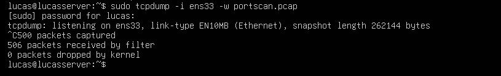

# Network Forensics Using tcpdump

This README covers two network forensics analyses using tcpdump captures: Portscan Analysis and Reverse Shell Detection. Screenshots referenced here are from the associated PDF documentation.

---

## Portscan Analysis

### Overview

This part analyzes a TCP portscan attack captured using tcpdump. The attacker machine is Kali Linux performing network scanning on a victim Ubuntu server network.

### Environment Setup

Attacker side (Kali Linux):

Victim side (Ubuntu server):

Captured 500 packets during the scan.

### Analysis

- Filter used to isolate SYN packets without ACK to identify connection attempts:
  

- The attacker is sending packets to multiple destination IP addresses (e.g., 192.168.54.95, 192.168.50.47) targeting port 7680 constantly to detect active services.

### Further Log Analysis

Detailed log analysis of this portscan capture has been performed using Zeek and Python:

- Zeek analysis repository: [Network Analysis with Zeek](https://github.com/joeljones29/Network-Analysis-with-Zeek)
- Python log parsing repository: [Log Parsing using Python](https://github.com/joeljones29/Log-Parsing-using-Python)

---

## Reverse Shell Detection

### Overview

Detection of a reverse shell session from attacker's Kali Linux to victim Ubuntu server via tcpdump capture. This scenario assumes that there might be a connection between the victim and the attacker.

### Environment Setup

Attacker side (Kali Linux):

Somehow a reverse shell script runs in the Ubuntu server, which was initiated by the attacker long ago during intrusion.

The attacker searches for this command to work and reach the attacker.

- Now the attacker has access to the Ubuntu server via reverse shell method.

Victim side (Ubuntu server):

- Enabled tcpdump

- Get the .pcap file and analyze it using Wireshark

- by right-clicking on a packet & then TCP stream option in “Follow” , the command was visible.

### Analysis

- Fetched reverse shell pcap file to PC and filtered TCP stream in Wireshark with `tcp.stream eq 6`.
- Followed TCP stream to reveal shell command (`whoami`) executed by attacker to confirm access.
- TCP details showed SYN, ACK, and PSH packets sequence in the reverse shell session.

---

- This README serves as an educational resource for TCP portscan and reverse shell detection using tcpdump.

